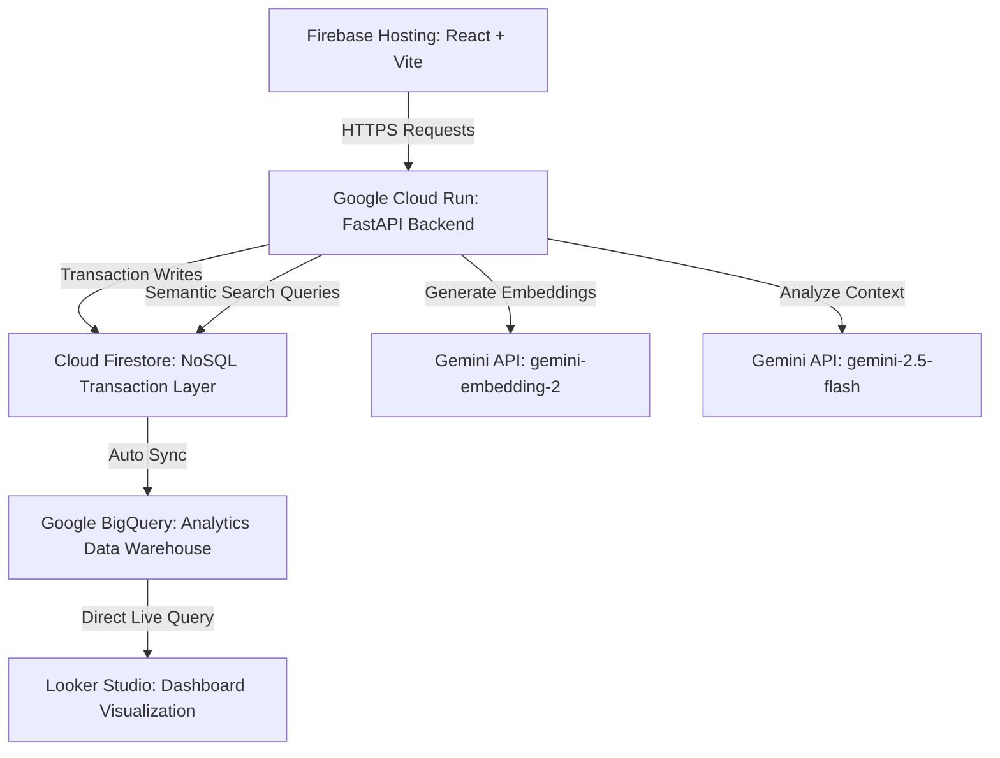

# Service-One: Serverless Home Appliance Repair Quote Auditor

Service-One is a serverless web platform designed to help consumers evaluate if their home appliance repair or installation quotes are fair. By analyzing location, appliance, service type, and price, the platform compares quotes against regional market benchmarks, active provider directories, historical community invoice reports, and trust signals to return a clear pricing verdict.

---

## Live Deployments

* **Frontend Web Application (Firebase Hosting)**: https://service-one-platform.web.app
* **Backend API (Google Cloud Run)**: https://service-one-backend-592281685075.us-central1.run.app

---

## Serverless Architecture and Core Databases

The project uses a unified serverless Google Cloud architecture:

* **Transactional Database (Google Cloud Firestore)**: Stores user details, quote history, local provider directories, and crowdsourced invoices.
* **Vector Store (Firestore Native Vector Search)**: Combines gemini-embedding-2 to translate crowdsourced records into 1536-dimensional vectors. Real-time community searches run semantically using Cosine Distance (find_nearest) queries directly in the database layer.
* **Data Warehouse (Google BigQuery)**: Analytical engine containing 13,960 invoice records synced from Firestore under dataset "serviceone_analytics" and table "community_reports", facilitating analytical Looker Studio reporting.
* **AI Orchestration**: Google GenAI SDK powered by gemini-2.5-flash for reasoning, negotiation script generation, and RAG context compilation.
* **Serverless Compute**: FastAPI backend containerized in a Docker image and running on Google Cloud Run. The frontend static export is deployed to Firebase Hosting.

### Architecture Diagram



---

## Detailed Directory and File Structure

The project structure is organized as follows:

```
service-one/
├── frontend/                               # React Frontend Application
│   ├── .firebase/                          # Firebase local environment cache
│   ├── .next/                              # Compiled Next.js cache directory
│   ├── dist/                               # Optimized production static build output
│   ├── public/                             # Static public assets (images, icons, svgs)
│   ├── src/                                # Source files
│   │   ├── app/                            # Next.js Application router pages
│   │   │   ├── dashboard/                  # User analytics dashboard
│   │   │   │   └── page.jsx                # Render savings, verdict charts, bookmarks
│   │   │   ├── result/                     # Verdict audit details page
│   │   │   │   ├── page.jsx                # Visual speedometer, price slider, RAG concierge, and map
│   │   │   │   └── ResultPage.css          # Styling rules for results card grid
│   │   │   ├── services/                   # Dynamic diagnostic query wizard
│   │   │   │   └── page.jsx                # Stepper Wizard for appliance repairs inputs
│   │   │   ├── login/                      # Login page
│   │   │   └── register/                   # Register page
│   │   ├── components/                     # Reusable modular components
│   │   │   ├── layout-next/                # Global layout wrappers (Header.jsx, Footer.jsx)
│   │   │   ├── ui/                         # Small UI dials (SpeedometerDial.jsx)
│   │   │   ├── PriceForecast.jsx           # historical trends graph (Recharts)
│   │   │   └── CommunityQueryBox.jsx       # AI concierge chat client UI
│   │   ├── App.jsx                     # Entry router declarations
│   │   └── index.css                       # HSL styling definitions and global styles
│   ├── .env                                # Active production and dev variables
│   ├── firebase.json                       # Deployment settings for Firebase Hosting
│   ├── next.config.js                      # Output configuration (output: 'export')
│   └── package.json                        # Frontend packages and scripts
│
├── backend/                                # Python FastAPI Application Backend
│   ├── agents/                             # Custom AI agents running under system instructions
│   │   ├── community_query_agent.py        # Semantic RAG concierge query responder
│   │   ├── lifespan_agent.py               # Appliance remaining operational lifespan analyzer
│   │   ├── locality_price_scraper_agent.py # Web directory price scraper auditor
│   │   ├── orchestrator_agent.py           # Multi-agent coordinator
│   │   └── trust_auditor_agent.py          # GSTIN registration status validator
│   ├── db/                                 # Datastore integrations
│   │   ├── database.py                     # Firestore client connection configurations
│   │   └── storage.py                      # Google Cloud Storage file upload helpers
│   ├── routes/                             # FastAPI HTTP route routers
│   │   ├── auth.py                         # Authentication and OAuth endpoints
│   │   ├── check.py                        # Authoritative pricing audit endpoint
│   │   ├── forecast.py                     # 6-month historical trends generator
│   │   └── providers.py                    # Verified local shop locator
│   ├── tests/                              # Pytest test suite folders
│   │   ├── test_agents.py                  # Agent reasoning tests
│   │   ├── test_community_upgrade.py       # RAG fallback checks
│   │   └── test_endpoints.py               # Routing integrations tests
│   ├── .env                                # Backend database access keys and ports configuration
│   ├── Dockerfile                          # Deployment specifications for Cloud Run
│   ├── requirements.txt                    # Active python packages list
│   └── main.py                             # API router definitions and server startup file
│
└── scripts/                                # Administrative database automation scripts
    ├── generate_synthetic_data.py          # Database vector seeder script
    ├── scrape_and_push_to_db.py            # Pricing scraper pipeline script
    └── sync_firestore_to_bigquery.py       # Firestore-to-BigQuery sync script
```

---

## How to Access and Run the Project

### Prerequisites
Ensure you have the following installed on your machine:
* Python 3.11 or higher
* Node.js 18 or higher
* Google Cloud SDK (gcloud CLI)

### 1. Running the Backend Locally
Navigate to the backend directory, activate the virtual environment, and start the development server:

```bash
cd backend
python -m venv venv
venv\Scripts\activate
pip install -r requirements.txt
uvicorn main:app --reload --host 127.0.0.1 --port 8000
```

### 2. Running the Frontend Locally
Navigate to the frontend directory, install npm packages, and run the Next.js development server:

```bash
cd frontend
npm install
npm run dev
```
The frontend website will run at http://localhost:5173.

### 3. Verifying the Automated Test Suite
To execute the automated pytest verification suite for agents and RAG routers, run:

```bash
cd backend
venv\Scripts\activate
python -m pytest
```

---

## Data Synchronization and Administration Scripts

The repository contains scripts under the scripts folder to maintain database operations:

* **Vector Database Seeder (scripts/generate_synthetic_data.py)**: Compiles synthetic repair records, fetches vector embeddings using gemini-embedding-2, and writes records with their vector representation to Firestore.
* **Scraper Loader Pipeline (scripts/scrape_and_push_to_db.py)**: Crawls/simulates local directory pricing signals, structures records, computes embeddings, and performs batch commits to both Firestore and BigQuery.
* **BigQuery Sync Tool (scripts/sync_firestore_to_bigquery.py)**: Scans all documents in the Firestore community_reports collection and streams them directly into the BigQuery serviceone_analytics dataset table.

### Accessing the BigQuery Console
The synced BigQuery table is accessible on the Google Cloud Console:
https://console.cloud.google.com/bigquery?project=service-one-platform
Expand the project tree and navigate to "serviceone_analytics" -> "community_reports" to query records.
